<!--
**gitSoyoungLee/gitSoyoungLee** is a ✨ _special_ ✨ repository because its `README.md` (this file) appears on your GitHub profile.

Here are some ideas to get you started:

- 🔭 I’m currently working on ...
- 🌱 I’m currently learning ...
- 👯 I’m looking to collaborate on ...
- 🤔 I’m looking for help with ...
- 💬 Ask me about ...
- 📫 How to reach me: ...
- 😄 Pronouns: ...
- ⚡ Fun fact: ...
-->

# Hi there 👋

안녕하세요 😊 이소영입니다.

끊임없이 배우고 성장하는 개발자를 꿈꾸고 있습니다!

## About Me
🎓 광운대학교 컴퓨터정보공학부 졸업

👩🏻‍💻 현재 백엔드 개발에 관심 있어요

☕ 혼자 달리는 속도보다, 함께 달리는 방향을 더 중요하게 생각합니다

💪 언제나 열심히 공부하는 개발자

📨 email: soo7132@naver.com

✒️ tech blog: https://syleeblog.tistory.com/

## Tech Stack

현재 이 분야들에 대해 중점적으로 공부하고 있어요.

   

 
 

 

---

